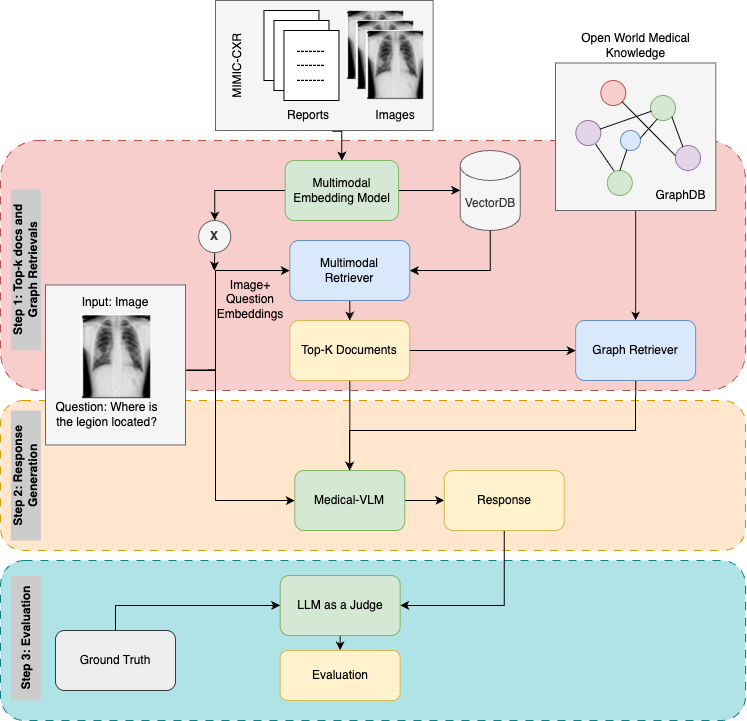

# Med-VQA-KGRAG
## Overview
Repository for final project submission for CS685 Advanced NLP by Prof. Haw-Shiuan Chang at 
UMass Amherst in Spring'25 semester. 

Team members include: Arghyadeep Das [(arghyadeepda@umass.edu)](mailto:arghyadeepda@umass.edu), 
Nilesh Nayan [(nnayan@umass.edu)](mailto:nnayan@umass.edu), 
Roshita Bhonsle [(rbhonsle@umass.edu)](mailto:rbhonsle@umass.edu) and 
Shantanu Todmal [(stodmal@umass.edu)](mailto:stodmal@umass.edu).

Through this project, we are trying to improve SoTA Medical Vision Language
Model's response by providing additional context through a customized pipeline. 
The pipeline includes integration of multimodal RAG, PrimeKG and Reports
data based knowledge graph in Microsoft's GraphRAG, Medical VLM inference and 
evaluation (traditional and LLM-as-a-judge metrics). For Medical VLM, we 
experimented on Microsoft's Llava-RAD, Stanford's ChexAgent and Meta's
LLaMA 11B visual-instruct.

## High Level Diagram


## Report
[Final Report](docs/CS685_Final_Project_Report.pdf) can be found in the repo.

## Code Structure
This repo contains all the codes involved in various parts of setup (explained next). The main parts include:
- Vector embeddings (multimodal) indexing and retrieval (using BioMedCLIP)
- Neo4J setup with PrimeKG (open source) data
- GraphRAG combined pipeline with text reports data along with Neo4J (FastAPI server)
- Python notebooks (Collab Pro and Kaggle) for loading and running inference for Medical Vision Language Models 
(Microsoft LLava RAD, Stanford ChexAgent, Meta LLaMA 11B Visual Instruct)
- Evaluation scripts (includes new metrics by Deepeval package)


## Installation and Setup

1. **Clone the Repository:**
    ```bash
    git clone https://github.com/arghyadeep99/Med-VQA-RAG.git
    cd Med-VQA-RAG
    ```

2. **Install Dependencies:**
    ```bash
    pip install -r requirements.txt
    ```
3. **Multimodal RAG** setup (FAISS: in-memory DB, high RAM usage)
4. **Setup Aura DB** with **PrimeKG** data (open-source) and insert credentials in code
5. **Setup Neo4J desktop** in local with credentials (provided by Neo4J official installation)
6. **Setup GraphRAG** (**OpenAI key** needed)
7. **Run backend server (local):** Once the above setup is completed
    ```bash
    python3 server_combined.py
    ```
8. Copy **Collab Pro** Notebooks and use **Nvidia A100** (40 GB VRAM) to collect model inference
9. Run evaluation scripts inside evaluation folder to generate metrics

## Contributions
Contributions are welcome to improve the project. 
Please follow these steps:

1. **Fork the Repository**
2. **Create a New Branch**
    ```bash
    git checkout -b feature-branch
    ```
3. **Commit Your Changes**
    ```bash
    git commit -m "Add new feature"
    ```
4. **Push to the Branch**
    ```bash
    git push origin feature-branch
    ```
5. **Create a Pull Request**

## License

This project is licensed under the GPT-2 License. See the [LICENSE](LICENSE) file for details.

## Contact

For any questions or suggestions, please open an issue or reach out to us at any of the above team members.

Thank you for visiting our repo!
